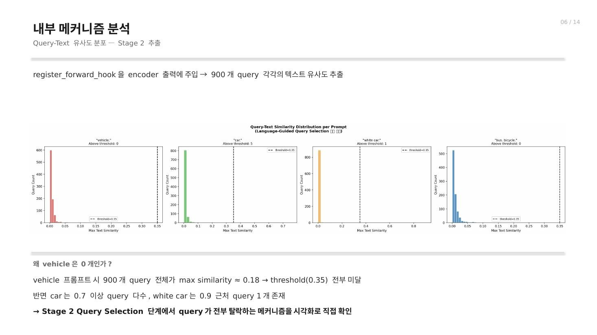
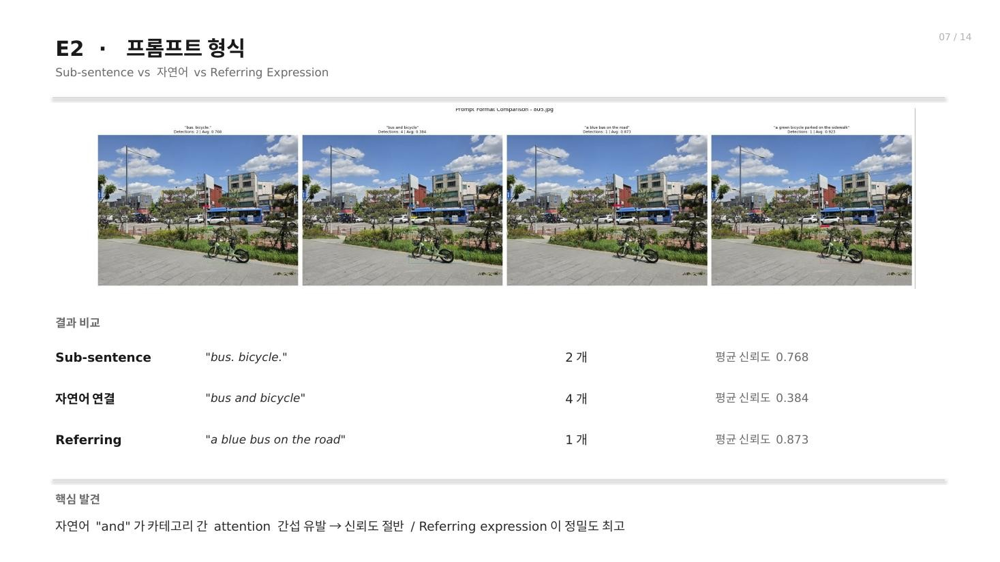
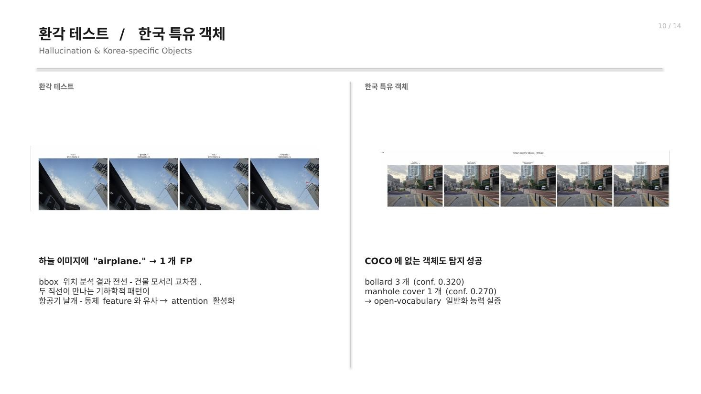
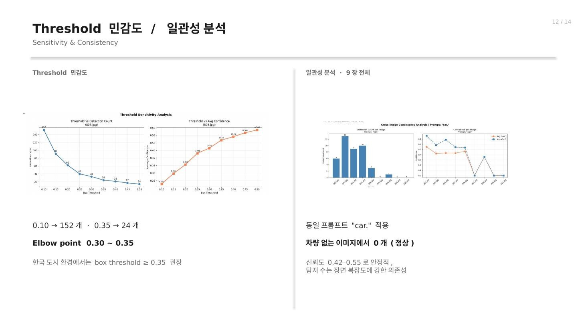
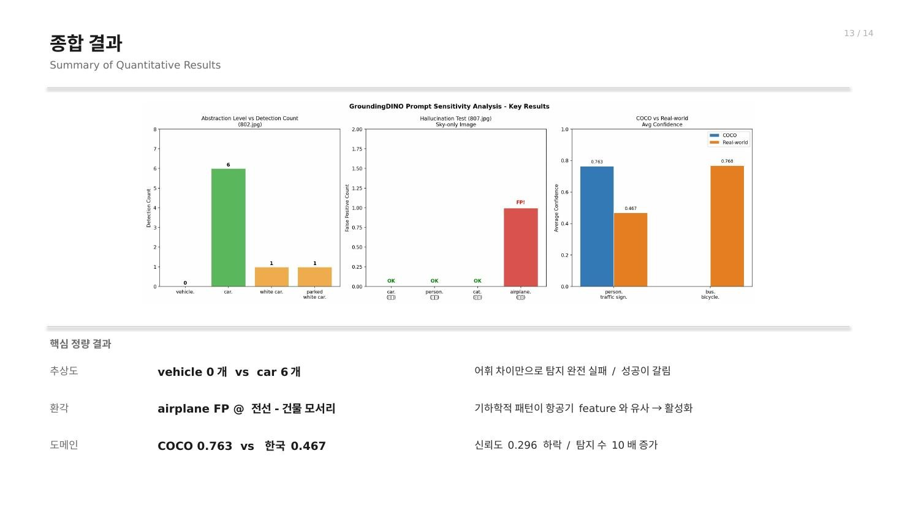

# GroundingDINO Prompt Sensitivity Analysis

[한국어](#-한국어) · [English](#-english)

---

# 🇰🇷 한국어

## 프로젝트 개요

GroundingDINO의 open-vocabulary object detection 성능이 **프롬프트 표현, 임계값, 시각적 환경 및 도메인 차이**에 따라 어떻게 달라지는지 분석한 컴퓨터비전 프로젝트입니다.

단순 inference 시연을 넘어, 한국 실생활 이미지와 COCO 이미지를 대상으로 탐지 수와 평균 신뢰도를 정량화하고, `register_forward_hook`을 이용해 Stage 2의 query-text 유사도 분포를 직접 추출하여 실패 원인을 내부 메커니즘 수준에서 분석했습니다.

## 실험 구성

- **모델:** GroundingDINO Swin-T
- **환경:** Google Colab T4 GPU
- **데이터:** 한국 실생활 이미지 9장과 COCO 검증 이미지
- **기본 임계값:** box 0.35, text 0.25
- **분석 대상:** 프롬프트 추상도, 문장 형식, 단어 순서, 부정 표현, 색상 속성, 환각, 저조도, 지역 특화 객체, 도메인 격차, 임계값 민감도

## 핵심 기여

- 동일 장면에서 프롬프트 표현만 바꾸는 통제 실험 설계
- 탐지 수와 평균 신뢰도를 이용한 프롬프트 민감도 정량 분석
- encoder forward hook으로 900개 query의 text similarity 분포 추출
- 한국 도로 환경과 COCO 이미지 간 도메인 격차 비교
- threshold sweep과 elbow point 분석을 통한 권장 임계값 도출
- 프롬프트 순서, 부정 표현 및 색상 속성에서 나타나는 구조적 한계 분석

## 주요 결과

| 분석 항목 | 관찰 결과 | 해석 |
|---|---:|---|
| 추상도 | `vehicle.` 0개 vs `car.` 6개 | 시각 문제가 아닌 lexical mismatch |
| 세부 속성 | `white car.` 1개, 평균 0.900 | 존재하는 색상 속성은 정밀도 향상 |
| 상태 속성 | `parked white car.` 1개, 평균 0.640 | 상태 표현은 신뢰도 저하 |
| 프롬프트 형식 | referring expression 평균 0.873 | 구체적인 지시 표현이 가장 높은 정밀도 |
| 부정 표현 | `car.` 6개 vs `no car.` 5개 | cross-attention에 명시적 억제 메커니즘 부재 |
| 도메인 격차 | COCO 0.763 vs 한국 환경 0.467 | 평균 신뢰도 0.296 하락, 탐지 수 약 10배 증가 |
| Threshold sweep | 0.10에서 152개, 0.35에서 24개 | 한국 도시 장면의 elbow point는 0.30-0.35 |
| 환각 | 하늘 장면에서 `airplane.` 1개 오탐 | 전선과 건물 모서리의 기하 패턴에 반응 |

> 이 결과는 9장의 소규모 실험 이미지에서 얻은 사례 분석이며, 일반적인 benchmark 성능을 의미하지 않습니다.

## 내부 메커니즘 분석



`vehicle.` 프롬프트에서는 900개 query의 최대 유사도가 약 0.18에 머물러 0.35 임계값을 모두 넘지 못했습니다. 반면 `car.`와 `white car.`는 임계값을 넘는 query가 생성되어, 같은 장면에서도 단어 선택이 Stage 2 query selection을 직접 바꾼다는 것을 확인했습니다.

## 시각적 실험 결과

### 프롬프트 형식



### 환각 및 한국 특화 객체



### Threshold 민감도와 장면 간 일관성



### 정량 결과 요약



## 실행 방법

정리된 Colab 노트북을 열고 셀을 순서대로 실행합니다.

```text
notebooks/groundingdino_prompt_sensitivity.ipynb
```

실환경 입력 이미지는 개인정보 및 제3자 정보를 보호하기 위해 저장소에 포함하지 않았습니다. 노트북의 `scene_01.jpg`부터 `scene_09.jpg`까지를 본인의 테스트 이미지로 교체하면 동일한 분석 흐름을 재사용할 수 있습니다.

## 보안 및 개인정보

- 원본 노트북에 포함됐던 GitHub 인증정보와 이메일은 공개본에서 완전히 제거했습니다.
- 개인 식별정보가 포함된 원본 보고서와 발표자료는 공개하지 않습니다.
- 공개 저장소에는 익명화된 실험 시각자료와 출력이 제거된 노트북만 포함합니다.
- 원본에 저장됐던 GitHub 토큰은 폐기하고 재발급해야 합니다.

## 한계

- 실환경 표본이 9장으로 작아 통계적 일반화에는 한계가 있습니다.
- 일부 정량 결과는 수동으로 기록된 실험 요약값입니다.
- 원본 실환경 이미지를 공개하지 않아 전체 결과의 완전한 재현에는 대체 입력 데이터가 필요합니다.
- GroundingDINO 버전과 GPU 환경에 따라 탐지 결과가 달라질 수 있습니다.

## 라이선스

MIT

---

# 🇺🇸 English

## Project Overview

This computer-vision project analyzes how GroundingDINO's open-vocabulary object detection changes with **prompt wording, thresholds, visual conditions, and domain shift**.

Beyond basic inference, the project quantifies detection counts and confidence scores on Korean real-world and COCO images. It also uses `register_forward_hook` to extract Stage 2 query-text similarity distributions and connect observed failures to the model's internal selection mechanism.

## Experimental Setup

- **Model:** GroundingDINO Swin-T
- **Environment:** Google Colab with an NVIDIA T4 GPU
- **Data:** Nine Korean real-world scenes and selected COCO validation images
- **Default thresholds:** box 0.35, text 0.25
- **Factors:** abstraction, prompt format, word order, negation, color, hallucination, low light, local objects, domain shift, and threshold sensitivity

## Contributions

- Designed controlled experiments that vary only prompt wording on the same scene
- Quantified prompt sensitivity through detection count and mean confidence
- Extracted text-similarity distributions for 900 queries with an encoder forward hook
- Compared Korean road scenes with COCO images to characterize domain shift
- Identified a practical 0.30-0.35 threshold range through an elbow-point analysis
- Investigated structural limitations involving word order, negation, and color attributes

## Key Results

| Analysis | Observation | Interpretation |
|---|---:|---|
| Abstraction | `vehicle.` 0 vs `car.` 6 detections | Lexical mismatch rather than a visual failure |
| Specific attribute | `white car.`: 1 detection, 0.900 mean confidence | A present color attribute improved precision |
| State attribute | `parked white car.`: 1 detection, 0.640 | State wording reduced confidence |
| Prompt format | Referring expression: 0.873 mean confidence | A specific referring expression was most precise |
| Negation | `car.` 6 vs `no car.` 5 detections | No explicit suppression mechanism in cross-attention |
| Domain gap | COCO 0.763 vs Korean scenes 0.467 | Confidence decreased by 0.296 while detections increased about 10x |
| Threshold sweep | 152 detections at 0.10 vs 24 at 0.35 | The observed elbow point was 0.30-0.35 |
| Hallucination | One `airplane.` false positive in a sky scene | Geometric similarity around wires and building edges |

> These findings are case-study observations from nine real-world images, not dataset-level benchmark claims.

## Internal Mechanism Analysis


For `vehicle.`, all 900 queries stayed below the 0.35 threshold, with a maximum similarity near 0.18. In contrast, `car.` and `white car.` produced above-threshold queries, showing that lexical choices directly affect Stage 2 query selection even on the same image.

## Visual Results

### Prompt Format


### Hallucination and Korea-Specific Objects


### Threshold Sensitivity and Cross-Image Consistency


### Quantitative Summary


## Usage

Open the sanitized Colab notebook and execute the cells in order:

```text
notebooks/groundingdino_prompt_sensitivity.ipynb
```

The original real-world images are excluded to protect personal and third-party information. Replace `scene_01.jpg` through `scene_09.jpg` with your own inputs to reuse the experimental workflow.

## Security and Privacy

- GitHub credentials and email addresses found in the original notebook were removed completely.
- Reports and slides containing personal identifiers are not published.
- The public repository contains only anonymized visual results and a notebook with outputs cleared.
- The GitHub token embedded in the original file must be revoked and replaced.

## Limitations

- The nine-image real-world sample is too small for statistical generalization.
- Some quantitative values were manually recorded from experiment summaries.
- Reproducing every original result requires replacement input images because private scenes are excluded.
- Results can vary across GroundingDINO versions and GPU environments.

## License

MIT
